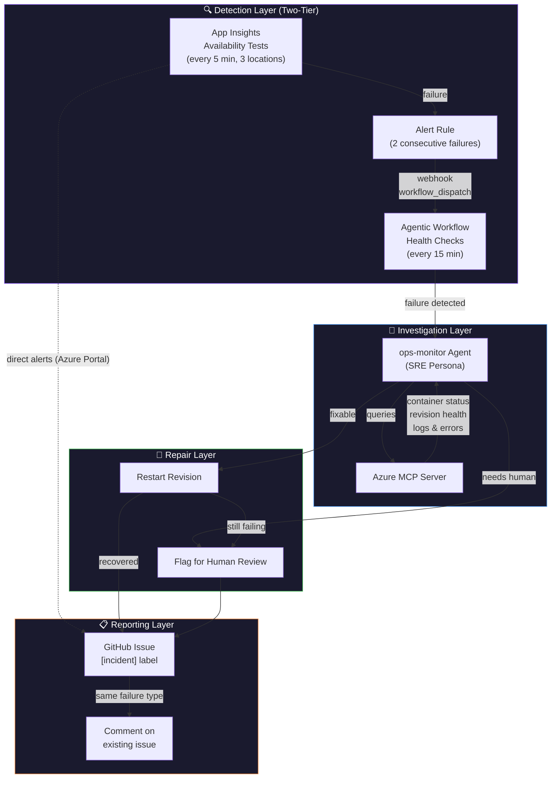
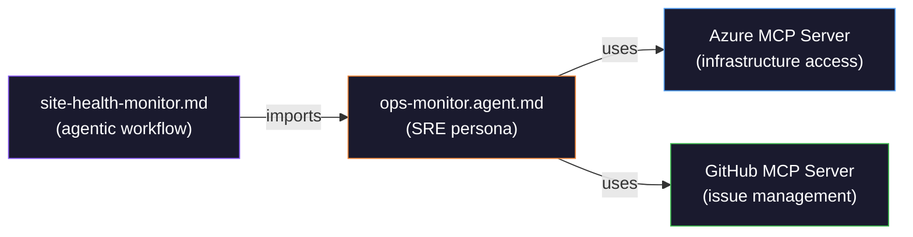

# 🩺 Monitoring & Auto-Repair Architecture

> Automated site health monitoring using GitHub Agentic Workflows, an SRE-specialized Copilot agent, and Azure Application Insights.

---

## Overview

This repository implements a **self-healing monitoring system** that detects site outages, investigates root causes, attempts automated repairs, and creates detailed incident reports — all without human intervention.

The system combines three technologies:
1. **Azure Application Insights** — Continuous synthetic monitoring (availability tests)
2. **GitHub Agentic Workflows** — AI-powered automation running Copilot CLI headless in GitHub Actions
3. **ops-monitor agent** — An SRE-specialized Copilot agent persona with incident response expertise

### Why This Approach?

Traditional monitoring alerts you when something is wrong. This system **investigates and fixes problems automatically**, then reports what happened. You review incident reports over coffee instead of getting paged at 3 AM.

---

## Architecture

### High-Level Flow

```
┌─────────────────────────────────────────────────────────────────┐
│                     DETECTION LAYER (Two-Tier)                    │
│                                                                  │
│  Tier 1: FAST DETECT              Tier 2: SMART CHECK            │
│  ┌──────────────────┐    ┌─────────────────────────────────┐    │
│  │  App Insights     │    │  Agentic Workflow (every 15 min) │    │
│  │  Availability     │    │  ┌───────────────────────────┐  │    │
│  │  Tests            │    │  │ HTTP 200 check            │  │    │
│  │  (every 5 min)    │    │  │ Content verification      │  │    │
│  │  3 US locations   │    │  │ agenda.json validation    │  │    │
│  │        │          │    │  │ Response time check       │  │    │
│  │        ▼          │    │  └───────────────────────────┘  │    │
│  │  Alert Rule       │    │                                  │    │
│  │  (2 failures)     │    │                                  │    │
│  │        │          │    │                                  │    │
│  │        ▼          │    │                                  │    │
│  │  Webhook ─────────│───▶│  workflow_dispatch (on-demand)   │    │
│  └──────────────────┘    └─────────────────────────────────┘    │
└─────────────────────────────────┬───────────────────────────────┘
                                  │ Failure detected (~5 min or 15 min)
                                  ▼
┌─────────────────────────────────────────────────────────────────┐
│                   INVESTIGATION LAYER                             │
│                                                                  │
│  ┌────────────────────┐    ┌──────────────────────────────┐     │
│  │  ops-monitor agent  │───▶│  Azure MCP Server            │     │
│  │  (SRE persona)      │    │  ┌──────────────────────────┐│     │
│  │                     │    │  │ Container App status     ││     │
│  │  • Incident mgmt   │    │  │ Revision health          ││     │
│  │  • Root cause       │    │  │ Container logs           ││     │
│  │    analysis         │    │  │ Environment health       ││     │
│  │  • Escalation       │    │  │ ACR image status         ││     │
│  │    procedures       │    │  └──────────────────────────┘│     │
│  └────────────────────┘    └──────────────────────────────┘     │
└─────────────────────────────────┬───────────────────────────────┘
                                  │ Diagnosis complete
                                  ▼
┌─────────────────────────────────────────────────────────────────┐
│                      REPAIR LAYER                                │
│                                                                  │
│  ┌─────────────────────────────────────────────────────────┐    │
│  │  Auto-Repair Actions (via Azure MCP)                     │    │
│  │                                                          │    │
│  │  ✅ Restart unhealthy revision                           │    │
│  │  ⚠️  Flag crash loops for human review                   │    │
│  │  ⚠️  Flag environment issues for human review            │    │
│  │  ❌ No destructive operations (delete/recreate)          │    │
│  └─────────────────────────────────────────────────────────┘    │
└─────────────────────────────────┬───────────────────────────────┘
                                  │ Repair attempted
                                  ▼
┌─────────────────────────────────────────────────────────────────┐
│                     REPORTING LAYER                               │
│                                                                  │
│  ┌─────────────────────────────────────────────────────────┐    │
│  │  GitHub Issues (safe-outputs)                            │    │
│  │                                                          │    │
│  │  🔴 [incident] Site Down — <failure description>         │    │
│  │  🟡 [incident] Site Recovered — <what was fixed>         │    │
│  │  📝 Comment on existing issue if same failure type       │    │
│  └─────────────────────────────────────────────────────────┘    │
└─────────────────────────────────────────────────────────────────┘
```

### Mermaid Diagram



---

## Components in Detail

### 1. Application Insights + Availability Tests

**What:** Azure-native synthetic monitoring that pings your site from multiple geographic locations.

**Configuration:** Defined in `infra/modules/app-insights.bicep`

| Setting | Value |
|---------|-------|
| Test frequency | Every **1 minute** |
| Locations | Virginia, Chicago, San Jose |
| Validation | HTTP 200 + SSL certificate health |
| SSL expiry warning | 7 days before expiration |
| Alert trigger | 2 failed locations within 5 min window |
| Alert action | Webhook → GitHub `workflow_dispatch` |
| Data retention | 30 days |
| Cost | Free (under 5GB/month ingestion) |

**What it catches:** Complete outages, SSL certificate expiry, DNS failures, regional availability issues.

**Two-tier detection pattern:**

```
Tier 1 — FAST (App Insights):    ping every 5 min → alert after ~2 min → webhook → workflow_dispatch
Tier 2 — SMART (Agentic Workflow): full AI check every 15 min (content, JSON, latency)
```

Both paths trigger the same `site-health-monitor.md` workflow. Tier 1 catches hard outages fast. Tier 2 catches subtle issues (broken content, corrupt JSON, degraded performance).

### 2. Site Health Monitor Workflow

**What:** A GitHub Agentic Workflow that runs Copilot CLI headless in GitHub Actions every 15 minutes.

**File:** `.github/workflows/site-health-monitor.md`

**How it works:**

```
┌──────────────┐     ┌──────────────┐     ┌──────────────┐     ┌──────────────┐
│  STEP 1      │     │  STEP 2      │     │  STEP 3      │     │  STEP 4      │
│              │     │              │     │              │     │              │
│  Health      │────▶│  Investigate  │────▶│  Auto-Repair  │────▶│  Report      │
│  Check       │     │  (if failed)  │     │  (if fixable) │     │  (if issue)  │
│              │     │              │     │              │     │              │
│  • HTTP 200  │     │  • App status │     │  • Restart   │     │  • Create    │
│  • Content   │     │  • Revisions  │     │    revision  │     │    issue     │
│  • JSON      │     │  • Logs       │     │  • Re-check  │     │  • Or add    │
│  • Latency   │     │  • ACR image  │     │    health    │     │    comment   │
└──────────────┘     └──────────────┘     └──────────────┘     └──────────────┘
       │                                                              │
       │ All healthy ─────────────────────────────────────────────────┘
       └──▶ Exit silently (no issue created)
```

**Health checks performed:**

| Check | What | Pass Criteria |
|-------|------|---------------|
| HTTP availability | Fetch site URL | HTTP 200 status |
| Content verification | Check response body | Contains "GitHub Copilot" |
| Agenda endpoint | Fetch `/agenda.json` | Valid JSON with `days` array |
| Response time | Measure latency | < 5 seconds (cold start exempt) |

**Safe outputs (write operations):**

| Output | Limit | Purpose |
|--------|-------|---------|
| `create-issue` | 1 per run | Incident report with `[incident]` prefix |
| `add-comment` | 3 per run | Updates to existing incident issues |

### 3. ops-monitor Agent

**What:** An SRE-specialized Copilot agent persona that shapes how the AI investigates and responds to incidents.

**File:** `.github/agents/ops-monitor.agent.md`

**Imported by:** `site-health-monitor.md` via the `imports:` frontmatter field



**What the agent brings:**
- **Incident management patterns** — Structured investigation, escalation procedures
- **SRE expertise** — Root cause analysis, failure mode recognition
- **Operational response** — Runbook-style repair actions
- **Handoffs** — Can escalate to `release-engineer` agent for emergency rollbacks

### 4. Azure MCP Server

**What:** Model Context Protocol server that gives the Copilot agent direct access to Azure infrastructure.

**Configured in:** Workflow frontmatter + `.vscode/mcp.json` (for local CLI use)

```yaml
mcp-servers:
  azure:
    command: "npx"
    args: ["-y", "@azure/mcp@latest", "server", "start"]
    allowed: ["*"]
```

**Capabilities available to the agent:**
- Query Container App status and provisioning state
- List and inspect revisions
- Pull container logs
- Check Container App Environment health
- Verify ACR image availability
- Inspect resource group resources

---

## Incident Response Flow

### Automated (no human needed)

```
 15-min scheduled check fails
        │
        ▼
                                    OR
                              
 App Insights ping fails ×2
        │
        ▼
 Webhook fires workflow_dispatch
        │
        ▼
 ┌──────────────────┐
 │ ops-monitor agent │
 │ investigates via  │
 │ Azure MCP         │
 └────────┬─────────┘
          │
    ┌─────┴─────┐
    │           │
    ▼           ▼
 Fixable?    Not fixable
    │           │
    ▼           ▼
 Restart     Create issue:
 revision    🔴 "Site Down"
    │        with diagnosis
    ▼        & recommended
 Re-check    human actions
 health
    │
 ┌──┴──┐
 │     │
 ▼     ▼
 OK    Still broken
 │     │
 ▼     ▼
Create  Create issue:
issue:  🔴 "Site Down"
🟡      (repair failed)
"Site
Recovered"
```

### Manual (ad-hoc debugging)

When you need to investigate interactively:

```bash
# Start Copilot CLI (Azure MCP auto-configured via .vscode/mcp.json)
copilot

# Ask the agent to investigate
> "Check the health of ghcp-hackathon-app in rg-ghcp-hackathon"
> "Show me container logs from the last hour"
> "What's the revision status? Is anything crash-looping?"
> "Restart the active revision"
```

You can also use the ops-monitor agent directly:

```bash
copilot --agent=ops-monitor
> "Investigate production health for the hackathon site"
```

---

## Security Model

The monitoring system follows gh-aw's defense-in-depth security:

```
┌─────────────────────────────────────────────┐
│  Agent Job (READ-ONLY)                       │
│                                              │
│  • contents: read                            │
│  • issues: read                              │
│  • actions: read                             │
│  • Azure MCP: read-only queries              │
│  • No direct write access to anything        │
└──────────────────┬──────────────────────────┘
                   │ Structured output
                   ▼
┌─────────────────────────────────────────────┐
│  Safe Output Jobs (SCOPED WRITE)             │
│                                              │
│  • create-issue: issues: write (max: 1)      │
│  • add-comment: issues: write (max: 3)       │
│  • Content sanitized before write            │
│  • Threat detection on agent output          │
└─────────────────────────────────────────────┘
```

**Key constraints:**
- The agent **never** has direct write permissions
- All mutations go through safe-outputs with sanitized content
- Network egress controlled by Agent Workflow Firewall (only allowed domains)
- No destructive operations (delete, recreate) are permitted
- Auto-repair limited to revision restarts

---

## Setup Guide

### Prerequisites

| Tool | Purpose |
|------|---------|
| [Azure CLI](https://learn.microsoft.com/cli/azure/) | Deploy infrastructure |
| [GitHub CLI + gh-aw](https://github.github.com/gh-aw/) | Compile & run workflows |
| [Docker](https://www.docker.com/) | Build container images |
| GitHub Copilot subscription | Agent execution |

### Step 1: Deploy Application Insights (with alert-triggered dispatch)

If you haven't deployed the latest infra (with App Insights + alert webhook), run:

```bash
az deployment group create \
  --resource-group rg-ghcp-hackathon \
  --template-file infra/main.bicep \
  --parameters baseName=ghcp-hackathon \
  --parameters githubDispatchToken=<YOUR_PAT>
```

This deploys:
- Application Insights + 1-minute availability test
- Alert rule (fires after 2 consecutive failures)
- Action group with webhook to trigger `workflow_dispatch`

> **Note:** The `githubDispatchToken` is a `@secure()` parameter — it won't be stored in deployment history. You can also pass it via a parameter file or Key Vault reference.

### Step 2: Compile the Health Monitor Workflow

```bash
gh aw compile
```

This generates `.github/workflows/site-health-monitor.lock.yml` from the markdown source.

### Step 3: Configure Secrets

| Secret | Where | Purpose |
|--------|-------|---------|
| `COPILOT_GITHUB_TOKEN` | Repo → Settings → Secrets → Actions | Copilot engine auth for agentic workflows |
| `WORKFLOW_DISPATCH_TOKEN` | Repo → Settings → Secrets → Actions | Fine-grained PAT (Actions: write) for Azure alert webhook |

The `WORKFLOW_DISPATCH_TOKEN` is passed to Bicep during deployment and used by the Azure alert action group to trigger `workflow_dispatch` on the health monitor workflow.

### Step 4: Commit & Push

```bash
git add .github/workflows/site-health-monitor.md
git add .github/workflows/site-health-monitor.lock.yml
git commit -m "Add site health monitor workflow"
git push
```

### Step 5: Verify

```bash
# Trigger a manual run
gh aw run site-health-monitor

# Check status
gh aw status --label monitoring
```

---

## Operational Runbook

### "I got an `[incident]` issue — what do I do?"

1. **Read the issue** — The agent includes full diagnosis, repair attempts, and recommendations
2. **If auto-repaired (🟡)** — Review the root cause; likely no action needed
3. **If still down (🔴)** — Follow the recommended actions in the issue body
4. **For deeper investigation** — Use Copilot CLI with Azure MCP (see Manual Debugging above)

### "How do I temporarily disable monitoring?"

```bash
# Disable the workflow via GitHub Actions UI or:
gh workflow disable site-health-monitor
```

### "How do I change the check frequency?"

Edit `.github/workflows/site-health-monitor.md` and change:
```yaml
on:
  schedule: every 15 minutes   # Change to: every 30 minutes, hourly, etc.
```
Then recompile: `gh aw compile`

### "How do I monitor a different URL?"

```bash
# One-time check against a different URL:
gh aw run site-health-monitor -f site_url="https://your-other-site.com"
```

Or update the default URL in the workflow's markdown body.

---

## Cost

| Component | Monthly Cost |
|-----------|-------------|
| Application Insights (free tier) | $0 |
| Availability Tests (3 locations) | $0 |
| Agentic Workflow runs (~2,880/month) | Copilot premium requests |
| **Total infrastructure cost** | **$0** |

The only cost is Copilot premium request usage for the agentic workflow runs. At every-15-min frequency, that's ~2,880 runs/month. Adjust frequency based on your quota.

---

## Related Files

| File | Purpose |
|------|---------|
| `.github/workflows/site-health-monitor.md` | Agentic workflow source |
| `.github/agents/ops-monitor.agent.md` | SRE agent persona |
| `infra/modules/app-insights.bicep` | Application Insights + availability test |
| `.vscode/mcp.json` | Azure MCP config for local CLI debugging |
| `.github/plugins.json` | Azure plugin reference |
